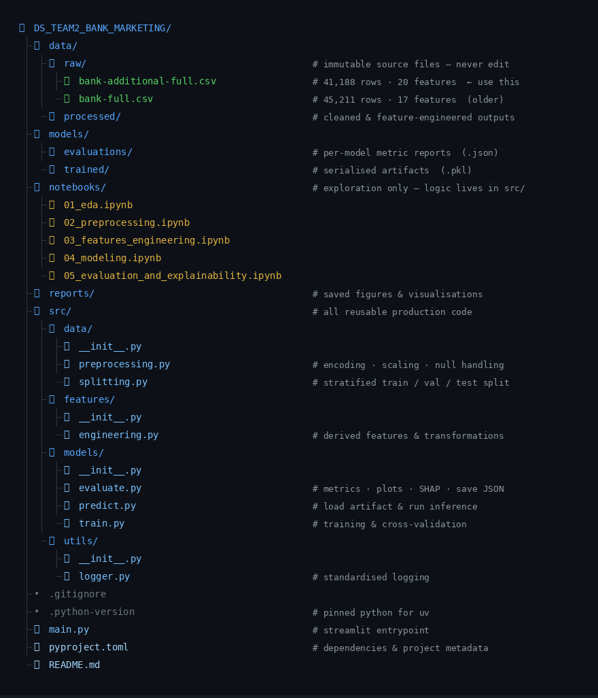

# Bank Marketing

# DS Team 2

Data
[UCI Bank Marketing dataset](https://archive.ics.uci.edu/dataset/222/bank+marketing)
(41,188 records, 20 features).

---

## Project Structure



---

## Setup

### Prerequisites

Install [uv](https://docs.astral.sh/uv/getting-started/installation/) if you don't have it:

```bash
curl -LsSf https://astral.sh/uv/install.sh | sh
```

### Install dependencies

```bash
# Create virtual environment and install all dependencies from pyproject.toml
uv sync
```

### Download the data

Download the dataset manually from:
[https://archive.ics.uci.edu/dataset/222/bank+marketing](https://archive.ics.uci.edu/dataset/222/bank+marketing)

Place the files at:
```
data/raw/bank-additional-full.csv
data/raw/bank-full.csv
```

---

## Running the Project

### Run notebooks

Run notebooks in order:

1. `01_eda.ipynb`
2. `02_preprocessing.ipynb`
3. `03_features_engineering.ipynb`
4. `04_modeling.ipynb`
5. `05_evaluation_and_explainability.ipynb`

### Train a model directly

```bash
uv run python src/models/train.py
```

### Launch the Streamlit dashboard

```bash
uv run streamlit run main.py
```

---

## Results

| version | model              | auc_roc | f1_yes | threshold | notes                              |
|---------|--------------------|---------|--------|-----------|------------------------------------|
| —       | —                  | —       | —      | —         | Run the notebooks to populate this |

---

## Key Design Decisions

- **`data/raw/` is immutable** — never modified after download; all transformations write to `data/processed/`
- **`src/` owns all logic** — notebooks import from `src/`, keeping them thin and readable
- **Evaluation is separated** — `04_modeling.ipynb` tunes on the val set; `05_evaluation_and_explainability.ipynb` reports final unbiased metrics on the test set.

---

## Team

DS Team 2 — University of Toronto, Data Sciences Institute
